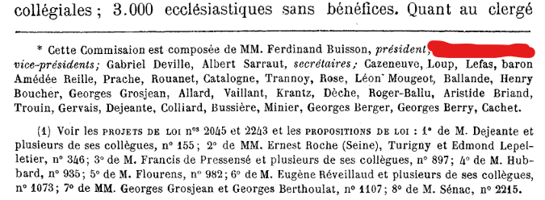

### Amen

https://www.adventofosint.com/en/2023/9

## Task

  

In 1905 Aristide Briand was the rapporteur for a commission with two vice-president having 2 and 3 first names.  
Give the first names in alphabetical order.  
(Example: Albert Antoine Barnabé Christian David) 

## Solution

1. Start with the [Wikipedia](https://en.wikipedia.org/wiki/Aristide_Briand).  
2. Now you know Aristide worked on [1905 French law on the Separation of the Churches and the State](https://en.wikipedia.org/wiki/1905_French_law_on_the_Separation_of_the_Churches_and_the_State).  
3. You can read more reading [Sacularism in France](https://en.wikipedia.org/wiki/Secularism_in_France) page.  
4. This challenge is similar to the previous one. You need to search on French sites. The best way to start is to translate `Aristide Briand Report` to Franch `Rapport Aristide Briand` and look for it in the google.
5. First result in google gives you the [report](https://www.assemblee-nationale.fr/12/evenements/1905/rapport1905-r.pdf).  
6. You find last names of 2 vice presidents on 6th page.  
  
7. You can find full names of [first](https://fr.wikipedia.org/wiki/Jean_Bepmale) and [second](https://fr.wikipedia.org/wiki/Th%C3%A9odore_Baudon) ones on the French Wikipedia.  

Answer
Auguste Eugène Jean Omer Théodore

Keyword
Rhume estival
