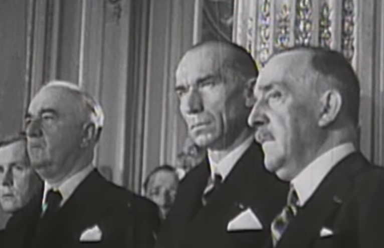
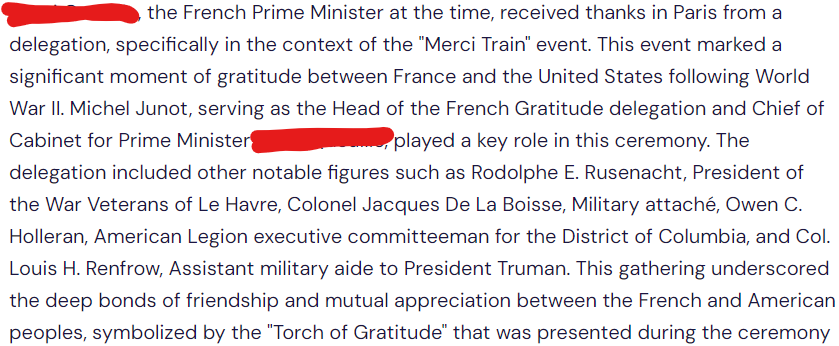
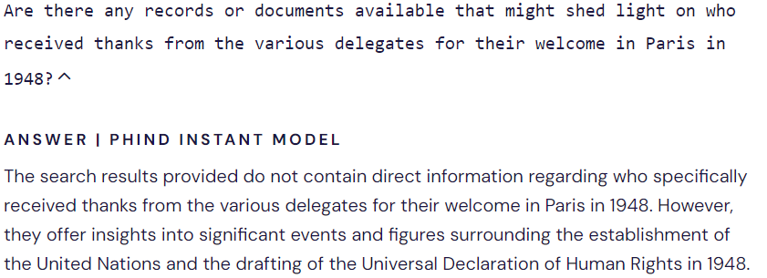
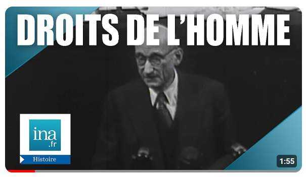

### Human rights

https://www.adventofosint.com/en/2023/10

## Task

  

This photo is taken from a vintage video in which the commentator indicates that these two men in black jackets received thanks from the various delegates for their welcome in Paris.  
1. From left to right, what are these two men's first names?  
A few seconds later, the commentator mentions "the UN's task, which is likely to be (?) and (?)".
2. Add the two missing words  
(Example: Rémy Marcel ardue passionnante)  

## Solution

1. Start with the https://facecheck.id/.  
2. It gives us the name of [one politician](https://en.wikipedia.org/wiki/Henri_Queuille).  
3. [Cylect.io](https://cylect.io/) comes in handy once again.  
 
4. Which leads to Universal Declaration of Human Rights.  
 
5. Looking for French translation `Ministres des Finances de l'Union occidentale 1948`. You will come across some [documents](https://www.cvce.eu/en/obj/report_of_the_meeting_of_the_five_finance_ministers_of_western_union_brussels_28_and_29_april_1948-en-01def6dd-0096-491b-8609-e39b772ee670.html) and a lot of videos on [French History youtube channel](https://www.youtube.com/@Inahistoire).  
6. Among dozens of videos there is [one](https://www.youtube.com/watch?v=vG5BRgJqiaI) featuring 3 men you are interested in.  
 
7. You can use https://youtubetranscript.com/ to get the transcript and translate it.  
8. There are three politicians mentioned in the middle: [1](https://pl.wikipedia.org/wiki/Vincent_Auriol) surrounded by [2](https://en.wikipedia.org/wiki/Henri_Queuille) and [3](https://pl.wikipedia.org/wiki/Andr%C3%A9_Marie).  
9. Just few seconds after, the commentator says "the UN's task will likely to be long and painful" which you can translate fo French.  

Answer
andré henri longue pénible

Keyword
BD sans bulle
