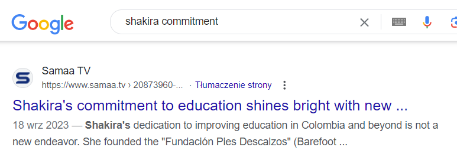

### Nobel

https://www.adventofosint.com/en/2023/11

## Task

  

Shakira, David Beckham, Roger Federer, Angelina Jolie and many other celebrities all share a commitment to a Nobel Peace Prize.  
For its 75th birthday, a sheet of stamps was issued.
What was the theme of the stamp above "Education"?  
(Example: Learn better) 

## Solution

1. Looking for 75th Noble Prize anniversary stamp gives no result.  
2. There is a line about celebrities commitment. Let's google it.    
  
  
  
  
3. A lot of websites mentiones philanthropy, education and humanitarian help through fundations. 4. It may be about Peace Noble Prize but `75th Peace Noble Prize anniversary stamp` doesn't hit the mark.  
4. We can see that David Beckham is a UNICEF ambassador.  
5. Searching for `nobel prize unicef 75th stamp` graphic gives us a hit. There was a stamp released on 75th UNICEF anniversary.   
  

Answer
humanitarian response

Keyword
Film et couette
