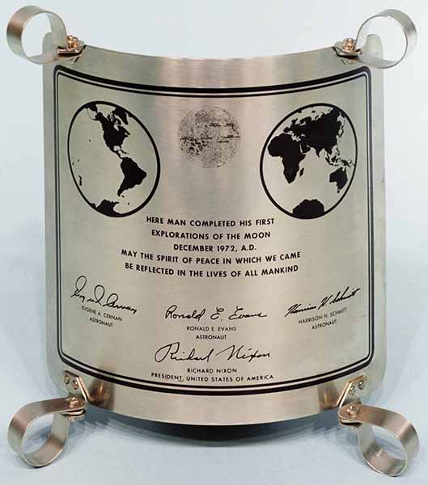

### Thanks Margaret

https://www.adventofosint.com/en/2023/13

## Task

  

This plaque is the last of a short series that will have marked history.  
1. On which valley has it been placed ?  
This whole mission has been recorded, filmed, transcribed...etc. Numerous traces of it can be found, and given the exceptional duration, a precise timeline helps navigate through it. Between the 169th and 170th hour, this plaque is unveiled with a brief speech.  
2. Which personality (first names and then last name) then addresses the two men from the command post ?  
(Exemple : fulgida-lucis Ethan Keith Turner)  

## Solution

1. Using google image search you find out there are more [plaques](https://en.wikipedia.org/wiki/Lunar_plaque) like that.  
2. You don't need to look for a specific place plaque was placed. Just go for the plase the [event](https://en.wikipedia.org/wiki/Apollo_17) happened.  
3. From now on it is easy to find the [recording](https://apolloinrealtime.org/) with timestamps. There is even one on the [Youtube](https://youtu.be/RWoMW9thdqc?si=0Phu49TZMbWgSfbh&t=25646) where you can see plaque uncovering.  
4. You don't need to watch the video. Everything regarding this [event](https://www.nasa.gov/history/alsj/a17/a17trans.html) was transcripted including this [part](https://www.nasa.gov/wp-content/uploads/static/history/alsj/a17/AS17_LM.PDF).  
5. The person mentioned in the task can be easily found on the [Wikipedia](https://en.wikipedia.org/wiki/James_C._Fletcher).  

First Answer
taurus-littrow
  

Second Answer
taurus-littrow
  

Keyword
Café ou thé
