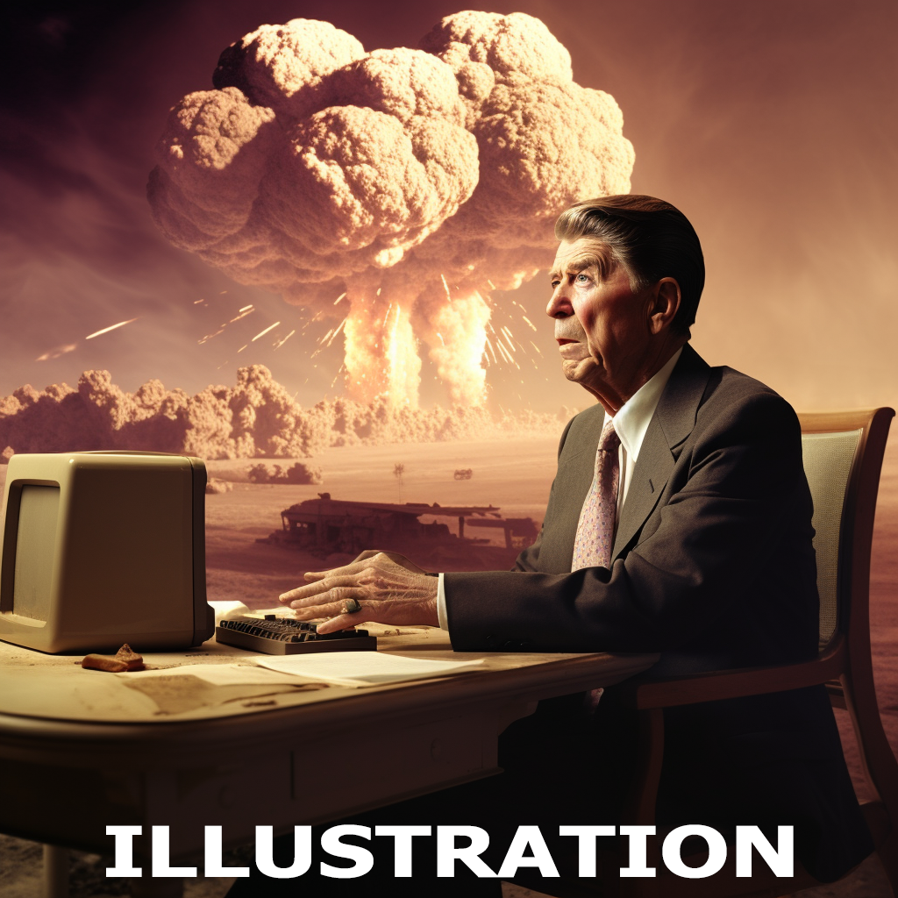
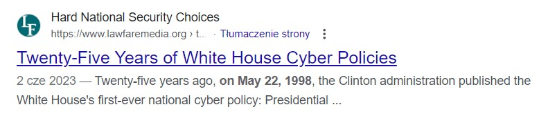
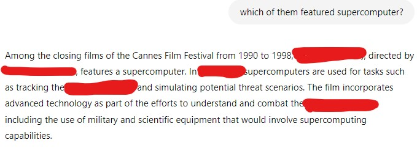
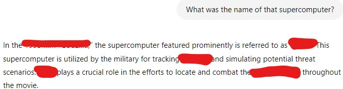
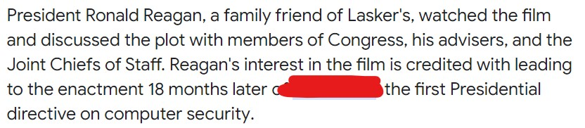
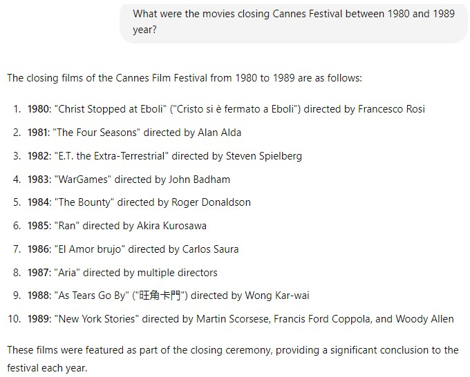
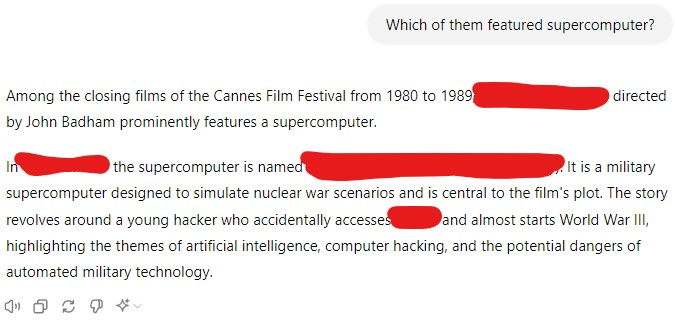

### Joshua

https://www.adventofosint.com/en/2023/14

## Task

  

It is said that the White House's first policy directive regarding hacking originates from a film that closed the Cannes Film Festival.  
1. What is the name of the supercomputer in the film?  
2. When was this directive declassified (YYYYMMDD)?  
(Example: JBCE 19980223)  

## Solution

1. Let's start simple. Google "White House's first policy directive regarding hacking".  
2. It gives us some hits like [this one](https://irp.fas.org/offdocs/pdd/pdd-63.htm).  
  
3. Not bad. We have the year. Now let's ask https://chatgpt.com/.  
    > What were the movies closing Cannes Festival between 1990 and 1998 year?  
  
    > Which of them featured supercomputer?  
  
    > What was the name of that supercomputer?  
  
4. Unfortunately name of the computer and disclose dates of the directive don't work.  
5. Let's start again by searching for `White House's first policy directive regarding hacking originates from a film`.  
  
6. Let's ask https://chatgpt.com/ one more time. This time about movies from 80'.  
    > What were the movies closing Cannes Festival between 1980 and 1989 year? 
  
    > Which of them featured supercomputer?  
  
7. Which directive was inspired by the [movie](https://en.wikipedia.org/wiki/WarGames) then?  
8. We can look for the information using https://cylect.io/, https://chatgpt.com/ or just a google. There are official [documents](https://irp.fas.org/offdocs/nsdd/nsdd-145.pdf) ew can look into.   
9. It is important to know that we are not asked about disclosure date but declassification date. It is handwritten by the stamp in the right bottom corner of the first page.  

First Answer
WOPR
  

Second Answer
19921207
  

Keyword
Champagne et paillettes
