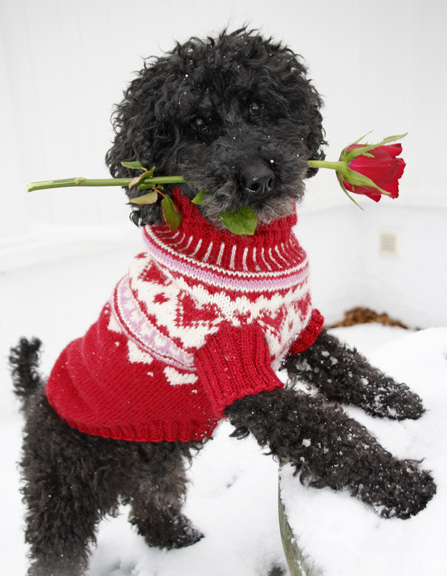
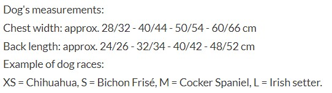
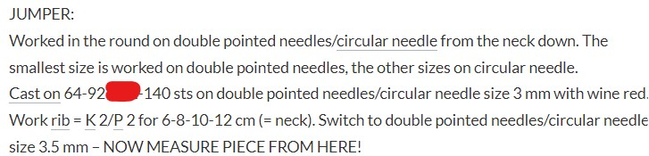

### Knitting

https://www.adventofosint.com/en/2023/15

## Task

  

On this International Christmas Sweater Day, you decide to knit this jumper for your beloved cocker spaniel.  
How much do you get by adding up the year in which International Christmas Sweater Day was created and the number of stitches you need to cast on to start your project?  
(Example: 1840)  

## Solution

1. Looking for an [International Christmas Sweater Day](https://en.wikipedia.org/wiki/Christmas_Jumper_Day) does not solve our riddle.  
We need to look on the French pages once again: [Journée internationale du pull de Noël](https://fr.wikipedia.org/wiki/Pull_de_No%C3%ABl) as it mentiones says this day originates 1 year earlier than the other one. 
2. Reverse searching dog in a sweater results in a page dedicated to [knitting](https://www.knittingpatternsgalore.com/item_type-pets-dogs.html) but it doesn't say anything about the sizes.  
3. Fortunatelly there is another [page](https://www.garnstudio.com/pattern.php?id=6515&cid=19) that mentiones sizes.  

4. There is even a part that mentiones exact number of stitches needed.  

First Answer
2011
  

Second Answer
112
  

Keyword
You are beautiful
