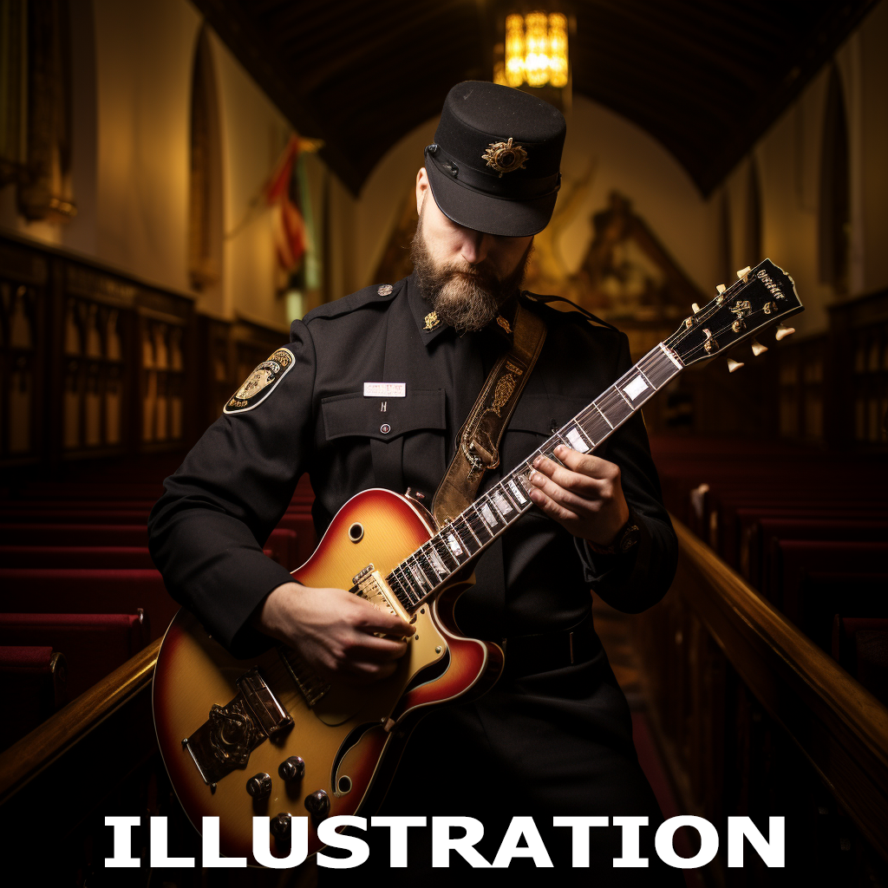
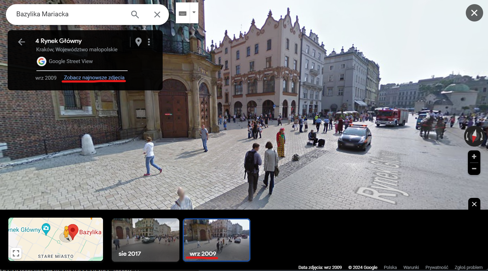

### Barbara

https://www.adventofosint.com/en/2023/4

## Task

I remember my visit to St Barbara's Church in Krakow as if it were yesterday, even thought it's been a little over 14 years ago...
After the visit, I had strolled along the square next to the basilica and an incredible scene unfolded before my eyes: a man in yellow checked overalls and a musician were looking at two policemen, who were getting out of their car to join a fireman, under the questioning gaze of the driver of a cart pulled by two horses.
In the local language, what colour was the right sleeve of the shirt of the man in overalls and what instrument was the musician playing?
(Example: zielony gitara)

## Solution

1. Look for a st Barbara's Church in Kraków on [google maps](https://maps.app.goo.gl/1TW9mHgCisuFcBzN7).
2. Go to the google street view and stay in front of the church. Change `see last date` to `2009` and there you have it.  

3. Use [google translate](https://translate.google.com/?hl=pl&sl=en&tl=pl&op=translate) to translate color and music instrument to Polish.

First Answer
czerwony

Second Answer
akordeon

Keyword
Chocolat et camembert
