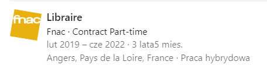
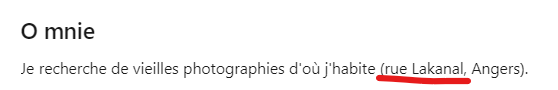

### Melvil

https://www.adventofosint.com/en/2023/6

## Task

  

You would like to consult the book by Isidore Galactique entitled "Saint Nicolas, les coulisses de la magie".
Only one library has this book. You check online if the book is available and go to the library. By chance, you bump into your bookseller friend Gérémy Poitudhie, who lives nearby.
What is the Dewey number of this book?
(Exemple : 532.9 HKO 7743051)

## Solution

1. First we can learn more about [Dewey numbers](https://csi.pressbooks.pub/cataloging/chapter/creating-call-numbers-using-dewey-decimal-classification/)  
The Dewey Decimal Classification (DDC) system, also known as the Dewey Decimal System, is a proprietary library classification system first published by Melvil Dewey in 1876. It is used to organize and arrange books and other library materials by subject. Each book is assigned a call number that consists of three main components such as class, division and section.  
2. We can use [Mevil Decimsl System builder](https://www.librarything.com/mds) to re-create the number from the scratch but this would take us ages. Maybe this is not the way.  
3. Let's look for a [Gérémy Poitudhie](https://www.linkedin.com/in/g%C3%A9r%C3%A9my-poitudhie-83b27a266) on linkedin.  
  
4. We cn see he worked as a part-timer in a local library.  
  
5. There are a lot of libraries in the area, such as [University Library](https://bu.uco.fr/), [St Nicholas Public Library](https://bibliotheques.angers.fr/iguana/www.main.cls?surl=saint-nicolas) or [Belle Beile University Library](https://bu.univ-angers.fr/).  
6. The most interesting is [Belle Beile University Library](https://bu.univ-angers.fr/) as it is the closes one to Gérémy's living place `rue Lakanal`.  
  
7. Search for an author `Isidore Galactique`.
8. Get the Dewey number.  
  

Answer
398.2 GAL 1302822

Keyword
Langoustines au four
