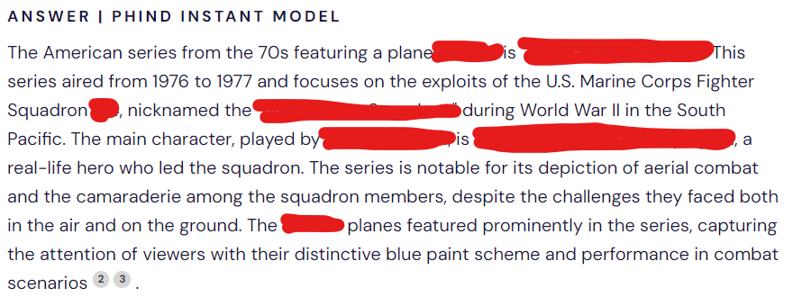
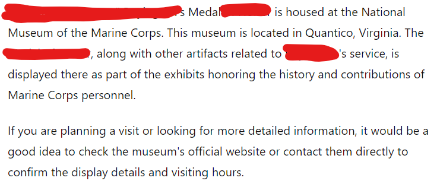

### Robert

https://www.adventofosint.com/en/2023/7

## Task

  

This plane is emblematic of an American series from the 70s.  
The main character was inspired by the life of a real-life hero.  
Among his medals, at which adress can you admire his highest US military honour?  
(Example: 401 Mickey Road)

## Solution

1. Searching for the plane using [Tineye](https://www.tineye.com/) you get the exact [Wikipedia](https://en.wikipedia.org/wiki/File:AU-1_Corsair_in_flight_1952.jpg) page.  
2. You can ask https://cylect.io/ for the series name, actor and main character.  
  
3. You can ask [Chat GPT](https://chat.openai.com/).  
 
4. When you check [National Museum of the Marine Corps](https://en.wikipedia.org/wiki/National_Museum_of_the_Marine_Corps) they don't have what you are looking for. Chat GPT is hallucinating.  
5. Ask https://cylect.io/ again.  
  
6. You get what we need with all the [details](https://www.cmohs.org/recipients/gregory-pappy-boyington) and [address](https://marinesmemorial.org/contact-us/).  

Answer
609 Sutter Street

Keyword
Pelle et seau
