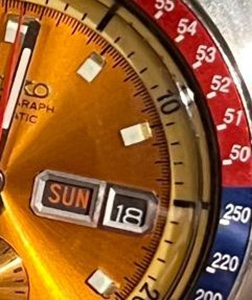
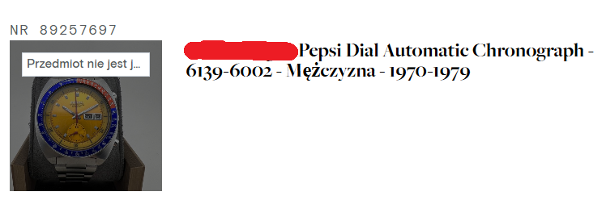
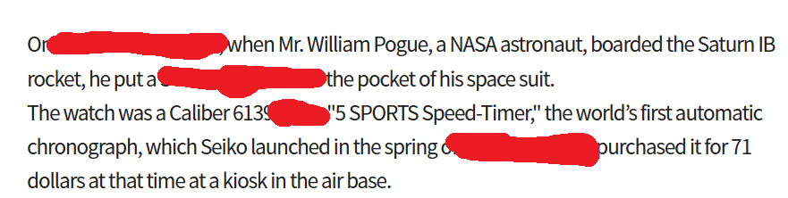

### December 1st, 2024
By OSINT4Fun  

https://www.osint4fun.eu/advent2024/en/1/

## Task

This watch, of which part is visible, has become legendary.  
On what date (YYYYMMDD format) did it take off?  
Answer format : 20121228

## Solution

1. Right click.  
2. Use Google Lens.  
3. Search for the watch [Results](https://www.catawiki.com/pl/l/89257697-seiko-pogue-pepsi-dial-automatic-chronograph-6139-6002-mezczyzna-1970-1979).  
  
4. Go to [Museum](https://museum.seiko.co.jp/en/knowledge/trivia10) and look for the date.  
  

Answer
19731116

Keyword
elastic bracelet
