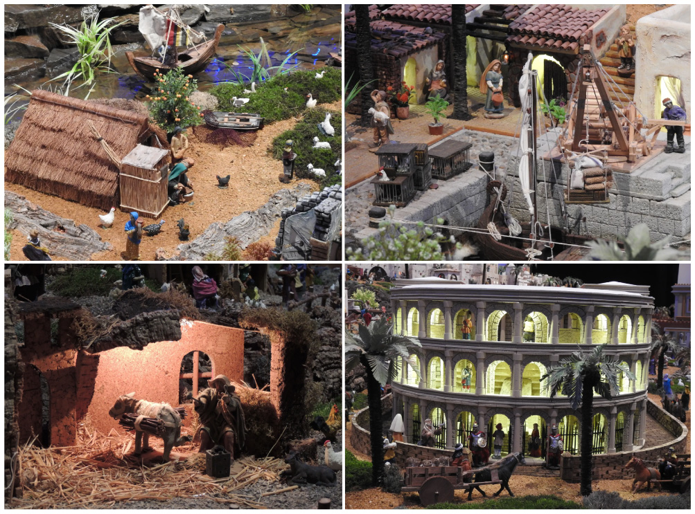
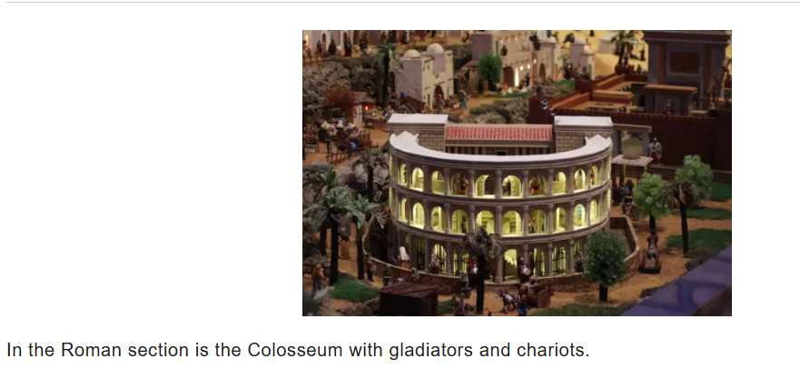
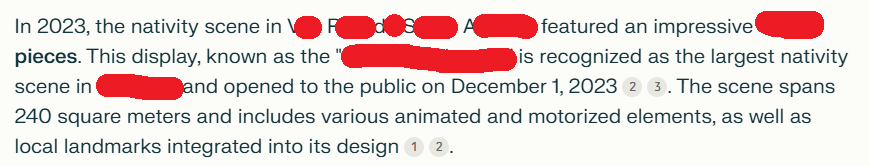

### December 2, 2024
By Sofia Santos  

https://www.osint4fun.eu/advent2024/en/2/

## Task

Nativity scenes have been popular for hundreds of years. While most are small, some can be quite large.  
The figure shows four close-up photos of a highly detailed diorama featuring a nativity scene.  
According to the official count, how many pieces were used (at least) in the 2023 set?  
Answer format : 1225  

## Solution

1. Right click.  
2. Use Google Lens.  
3. Zoom colosseum rectangle to find a photo [Results](https://algarvemoods.com/en/nativity-scene-vrsa/).  
  
4. Go to the https://www.perplexity.ai/ and ask `According to the official count, how many pieces were used to create nativity scene in V*** R*** d* S**** A****** in 2023?`.  
  

Answer
5800

Keyword
straw unicorn
