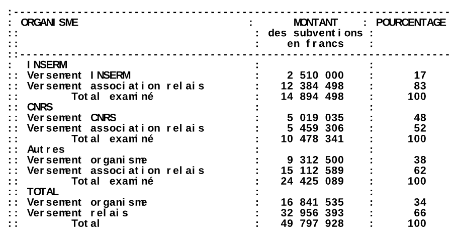

### December 4, 2024
By Project FOX

https://www.osint4fun.eu/advent2024/en/4/  

## Task

In France, among its various missions, the "Cour des Comptes" oversees the accuracy of the accounts of companies receiving donations.  

In this context, it has repeatedly examined the finances of the organization managing "Téléthon" funds.  

In its oldest report on the matter, the Court raised concerns regarding "intermediary organizations or associations" and noted that "the trend [...] has intensified".  
Based on the report data, give the initial value, the final value and calculate by how much this trend has increased as a percentage.  
Answer format : 62% 53% 48%  

Warning : do not use the English language site of "Cour des Comptes", it is not functional. If you use this site, use an automatic translation tool (such as Google) on the French pages.  

## Solution

1. Go to the [Cour des Comptes](https://www.ccomptes.fr/fr) page.  
2. Search for [Téléthon](https://www.ccomptes.fr/fr/recherche?search=telethon&sort_by=search_api_relevance&items_per_page=10).  
3. Click on the oldest [Report](https://www.ccomptes.fr/fr/publications/association-francaise-contre-les-myopathies-afm). The one from 01.03.1996.  
4. Open [pdf](https://www.ccomptes.fr/fr/documents/1682) and use google translate.   
5. Now it is a time for a tedious work an looking through tables. There is one with subventions and some interesting numbers above.  
  
6. Now you need to calculate the percentage. [ChatGPT](https://chatgpt.com/) may help.  

Answer
40% 34% 15%

Keyword
tricolor scarf
