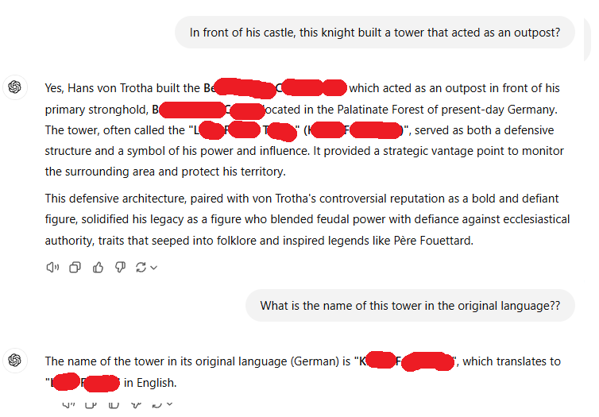

### December 6, 2024
By IsFred

https://www.osint4fun.eu/advent2024/en/6/  

## Task

Today is a day of celebration! It's Christmas early!  
I hope you found a mandarin and sweets in your shoe this morning.  
We can easily find the original name of the knight who inspired the story of one of Saint Nicholas's companions.  
In front of his castle, this knight built a tower that acted as an outpost.  
What is the name of this tower in the original language?  
Answer format : Befestigte-Burg  

## Solution

1. Ask [ChatGPT](https://chatgpt.com/) for the name.  
  
2. Now you need a tower name.  
  
3. Find the same answer on [french history website](https://frenchmoments.eu/hans-trapp/).  

Answer 1
Klein-Frankreich

Question
On Hans von Trotha's stone, the names of two saints are engraved. What are the names of these two saints?

Answer 2
Hans von Trotha is also named "Hans Droth". Looking for his [grave](https://www.westpfalz.wiki/wiki/das-grab-des-ritters-hans-von-droth-in-der-st-anna-kapelle/) you fint the inscription: “† Ano Dominy 1503 On the Thursday before Simon and Jude of the Apostles (26.10.) died the strict Hans the Great Knight, with God’s blessing. Amen.”

Keyword
blessed bulwark
