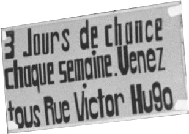

### December 8, 2024
By OpenFacto

https://www.osint4fun.eu/advent2024/en/8/  

## Task

Today is a special day for all Lyon residents, a day of celebration.  
Several years ago, they even had a chance to win a prize, if they went to rue Victor Hugo.  
What could one win (in french)?  
Answer format : camcorder  
  

## Solution

1. Check what is [rue Victor Hugo](https://en.wikipedia.org/wiki/Rue_Victor-Hugo,_Lyon).  
2. Check what happens in Lyon on [8th December](https://en.wikipedia.org/wiki/Festival_of_Lights_(Lyon)).  
3. Google `3 Jours de chance chaque semaine. Venez tous Rue Victor Hugo` in incognito mode to find a [photo set](https://www.leprogres.fr/societe/2021/12/07/a-quoi-ressemblait-la-fete-des-lumieres-il-y-a-une-cinquantaine-d-annees) from that event (27th photo).  

 

Answer
sapin

Question 1
In the newspaper where the previous illustration was from, 50 years earlier on Christmas Day, a lit Christmas tree made the front page. In which city was this tree located?

Answer
Name of the newspaper is "le progres" and the photo was taken in 1974. We need to go back to 1924. Google "le progres archive 1924" and go to the [archive](https://gallica.bnf.fr/ark:/12148/bd6t527439503). Answer is: `Copenhagen`.

Keyword
crumpled newspaper
