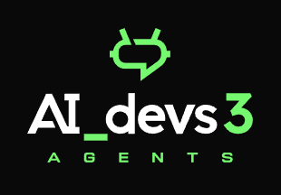

## AI DEVS 3 PRE

`https://poligon.aidevs.pl/`

> Witaj numerze piąty. Cieszy nas, że udało Ci się zalogować do programu szkoleniowego. Znajdujesz się w środowisku testowym, w którym możesz przećwiczyć w praktyce umiejętności, które zdobyłeś, studiując nasze materiały wstępne.

>Przypominamy, że już 4 listopada zostaniesz wysłany do roku 2024. Poniższe zadania wiernie imitują zasady działania LLM-ów znanych w tamtych czasach. Wykonaj te ćwiczenia, aby być gotowym na to, co czeka na Ciebie już niebawem.

> Do zobaczenia w przeszłości

## Zadania szkoleniowe

> Pamiętaj, że wszystkie zadania są wspólne dla wszystkich uczestników. Nie przeszkadzaj innym. Wszystkie odpowiedzi są generowane losow, więc ich znajomość Ci w niczym nie pomoże.

### CHAT
Szlifuj umiejętności wydobywania informacji poprzez budowę sprytnych promptów.

### API
Naucz się komunikacji z API, z którym przyjdzie Ci zmierzyć się w 2024 roku